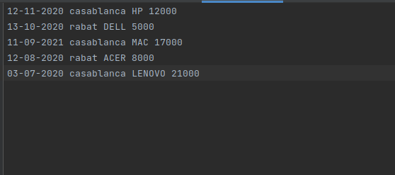
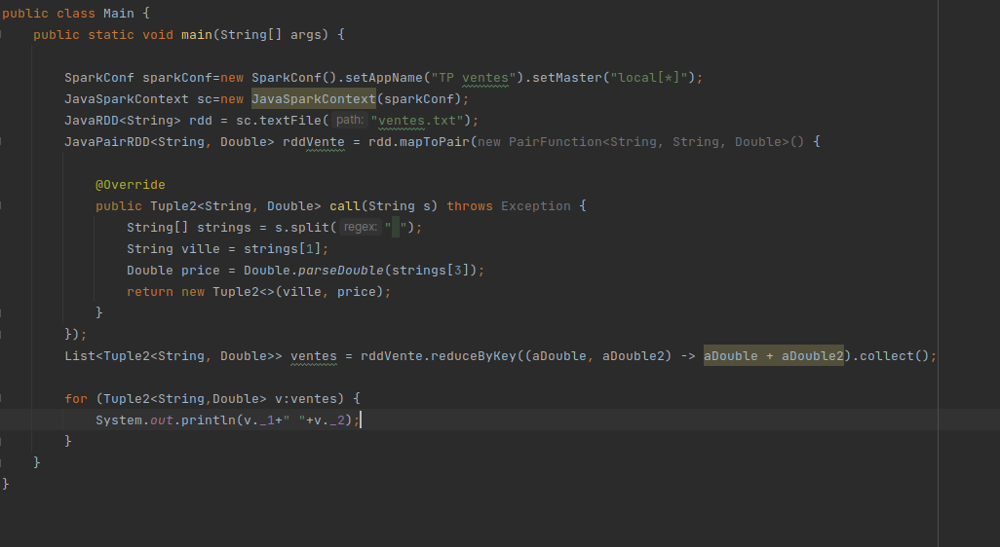
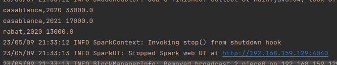

# TP-RDD-ventes
<h1> 1.total city sales using Spark RDD </h1>
<h2> Sales File </h2>

<h2> Code </h2>

<h2> Output </h2>

<h2> 2.total city sales per year using Spark RDD </h2>

<h2> Output </h2>

